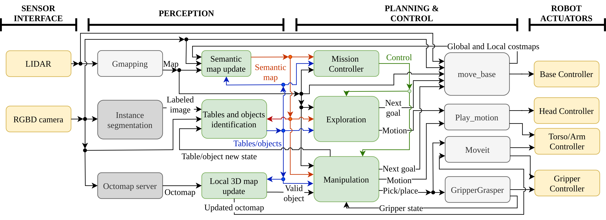
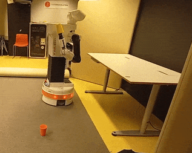

## catkin_ws_autonomous_tidy_up

Code developed for **Autonomous manipulator robot navigation to tidy up unknown environments** paper and Master's thesis by Letícia dos Santos under the supervision of Jim Torresen, Mariana Kolberg, and Renan Maffei.

From Institute of Informatics, Universidade Federal do Rio Grande do Sul, Porto Alegre, Brazil:
- Letícia dos Santos: lsantos@inf.ufrgs.br
- Renan Maffei: rqmaffei@inf.ufrgs.br
- Mariana Kolberg: mariana.kolberg@inf.ufrgs.br

From Department of Informatics and RITMO, University of Oslo, Norway:
- Jim Torresen: jimtoer@ifi.uio.no

This code implements the following system:



More details at the Master's thesis [here]() and on the paper [here](). Video of the test with the real robot at University of Oslo lab [here](https://www.youtube.com/playlist?list=PL93mJkxVSzyQpZxOhE7NLlZv27-3-pwFS).

Robot tidying up the yellow cup from the test with the real robot, speedup x10:




🤖 Any questions or problems with the code of this repository, please contact us by email: lsantos@inf.ufrgs.br

The Gazebo models used in this work are on model_editor_models and building_editor_models folders. The original models for some objects are available [here](https://fuel.gazebosim.org/1.0/LeDSantos/fuel/collections/Autonomous%20manipulator%20robot%20navigation%20to%20tidy%20up%20unknown%20environments%20-%20public%20objects).

# Recomended enviroment:

- Ubuntu 20.04
- singularity-ce 3.11.4-focal. Fourther information [here](singularity_files/READEME.md).
- NVIDIA GPU recommeded driver

# To compile the code:

Set the enviroment and download this repository:

```sh
$ git clone https://github.com/LeDSantos/catkin_ws_autonomous_tidy_up.git
```

Download the Singularity image: https://drive.google.com/file/d/1ejx5BQBuqmfi5IweD9WeJYN6rL5RS6F7/view?usp=sharing at the singularity_files folder. 

At singularity_files folder, get inside the image:

``` sh
$ singularity shell --nv ros-melodic-pal_public_docker_custom.sif
```

Test the TIAGo simulation following the [tutorial](https://wiki.ros.org/Robots/TIAGo/Tutorials/Installation/Testing_simulation).

At catkin_ws_autonomous_tidy_up folder, compile for the first time:

``` sh
$ source /opt/ros/melodic/setup.bash
$ catkin_make
```

In case of problems with the first catkin_make:
```sh
$ export CMAKE_PREFIX_PATH=/home/your_user/your_path/catkin_ws_autonomous_tidy_up/devel:/tiago_public_ws/devel:/opt/ros/melodic
```

Set the permission for this files:

``` sh
$ chmod 775 run_local_master.sh
$ chmod 775 run_tiago_master.sh
```

To exit a singularity image:

``` sh
$ exit
```

# To configure the aproach:

The configuration can be set at [autonomous_tidy_up.cpp](src/autonomous_tidy_up/src/autonomous_tidy_up.cpp):

- EXPLORE_THEN_TIDY_UP determines Explore then Tidy-Up mode or Immediate Tidy-Up mode.

- The navigation/exploration strategy is determined by STRATEGY_BVP_CLASSIC, STRATEGY_VORONOI or STRATEGY_GRID.

 - STRATEGY_BVP_PLUS_VORONOI adds the Voronoi otimization, that cooresponds to our proposal.

- SIMULATION == false adds stops during execution. This helps to execute slower at the real robot. The execution will continue after receving true at /continue_execution topic.

- GMAPPING_EXPLORATION == true saves the map created by gmapping.

- Other values are adjustable too.

IMPORTANT: SIMULATION should also be set at [camera_data_processing.cpp](src/autonomous_tidy_up/src/camera_data_processing.cpp) and [octomap_and_planning_scene.cpp](src/autonomous_tidy_up/src/octomap_and_planning_scene.cpp). Other values are repeted in these files too.

# To execute the strategy:

You will need **five terminals** to execute the autonomous tidy-up strategy. Execute the commands in each terminal at the singularity_files folder:
``` sh
$ singularity shell --nv ros-melodic-pal_public_docker_custom.sif
$ cd ..
$ source devel/setup.bash
$ source ./run_local_master.sh ## for simulation
```

You can use [run_tiago_master.sh](run_tiago_master.sh) in case that the real robot is connected to the computer, but edit the file to your robot and your computer IP.

On the **first terminal**, there are this options to start the simulation:

- [tiago_simulation_gmapping.launch](src/autonomous_tidy_up/launch/tiago_simulation_gmapping.launch): the robot builds the map on the fly.
- [tiago_simulation_previous_map.launch](src/autonomous_tidy_up/launch/tiago_simulation_previous_map.launch): the robot uses a previous map that is on src/autonomous_tidy_up/maps folder.
- [tiago_map_server_real_robot.launch](src/autonomous_tidy_up/launch/tiago_map_server_real_robot.launch): launches only the map server for the real robot. The real robot should be connected to the computer.
- [tiago_simulation_new_map.launch](src/autonomous_tidy_up/launch/tiago_simulation_new_map.launch): used to create a new map while moving the robot at the room with Rviz interface or [key_teleop.py](http://wiki.ros.org/Robots/TIAGo/Tutorials/motions/key_teleop#Running_key_teleop).

In all the launchs (exept tiago_map_server_real_robot.launch), you should select the enviroment and the start position for Gazebo simulation:

- world = garage_kitchen_bedroom or garage_kitchen_bedroom_no_doors
- gzpose = for GARAGE, KITCHEN or BEDROOM

After you choose a launch file:
``` sh
$ catkin_make
$ cd src/autonomous_tidy_up/launch
$ roslaunch tiago_....launch public_sim:=true robot:=steel rviz:=false
```

**Second terminal**, the strategy core:
``` sh
$ roslaunch autonomous_tidy_up run_autonomous_tidy_up.launch
```

OBSERVATION: this launch also starts the metrics node, you can dissable this editing the launch file.

You can select autonomous_tidy_up.rviz that is on configs_rviz folder to visualize the robot and all the important topics at Rviz.

**Third terminal**, instance segmentation and camera data processing:
``` sh
$ roslaunch autonomous_tidy_up mask_rcnn_73b2_kitchen_and_data_processing.launch
```

**Fourth terminal**, octomap server and planning scene manipulation:
``` sh
$ roslaunch autonomous_tidy_up octomap_server.launch
```

**Fiveth terminal**, after all the other nodes are running, ready and waiting the start, use this to start the execution:
``` sh
$ rostopic pub /start_demo std_msgs/Bool "data: true"
```

OBSERVATION: The system modules presented in the diagram do not have an exact correspondence to a determined file:

- [octomap_and_planning_scene.cpp](src/autonomous_tidy_up/src/octomap_and_planning_scene.cpp) contains Local 3D map update. 

- [camera_data_processing.cpp](src/autonomous_tidy_up/src/camera_data_processing.cpp) contains most part of Tables and object identification.

- [autonomous_tidy_up.cpp](src/autonomous_tidy_up/src/autonomous_tidy_up.cpp) contains the filterring and storage of tables and objects. Also has the Semantic map update, Mission Controller, Exploration and Manipulation modules.

# During execution:

It is used a Gazebo plugin to attach an object to the gripper. So, when running a simulation, you should inform the name of the next object that the robot will pick. For example, the cup that is near the robot when it starts on the Garage is the "cup_glass_test_6" for Gazebo.

When the robot is approaching the cup to pick in the Manipulation stage, send the name:
```sh
$ rostopic pub /object_name_to_gazebo_ros_link_attacher std_msgs/String "data: 'cup_glass_test_6'"
```

The code will attach the object if the robot grabs it. This is important to move the robot while holding the object in simulation.

For SIMULATION == false, you can use the following command to continue the execution after the safety stops:
```sh
$ rostopic pub /continue_execution std_msgs/Bool "data: true"
```

If metrics node is running, the logs will be at src/autonomous_tidy_up/logs/(enviroment):
- Each execution produces a semantic_report(data)\_(starting time).txt with the final state of objects and tables, and test_(data)\_(starting time).csv with trajectory and more data collected during the execution.
- Images from the maps are recorded at test_(data)\_(starting time)\_coverage_(stage number).pgm and test_(data)\_(starting time)\_semantic_(stage number).pgm.

If GMAPPING_EXPLORATION == true, the local where it saved the map will appear at the terminal.